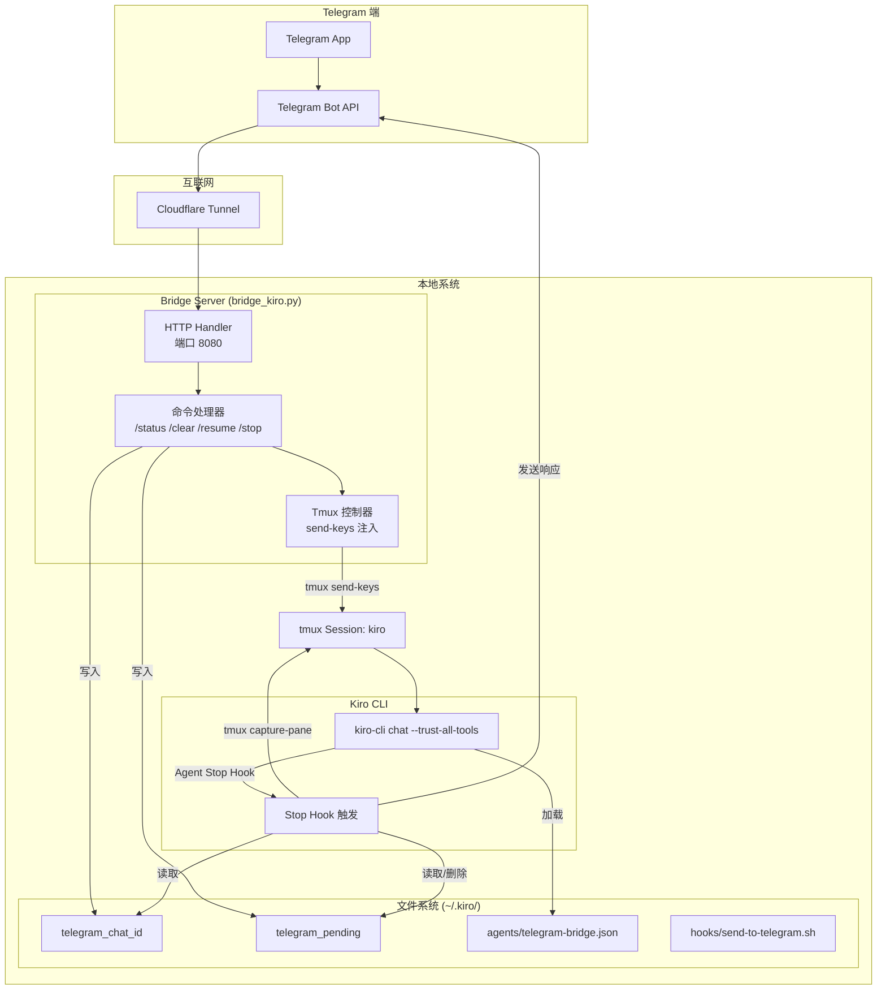

# kiro-telegram

[English](README.md) | [迁移报告](ClaudeCodetoKiroCLIMigrationAnalysisReport.md)

Kiro CLI 的 Telegram 机器人桥接工具。通过 Telegram 发送消息，获取 Kiro 的响应。

## 工作原理



### 数据流

1. **消息接收**: Telegram → Cloudflare Tunnel → Bridge Server
2. **消息注入**: Bridge Server → tmux send-keys → Kiro CLI
3. **响应获取**: Kiro CLI Stop Hook → tmux capture-pane → 解析输出
4. **响应发送**: Stop Hook → Telegram Bot API → Telegram

## 前置条件

```bash
# macOS
brew install tmux cloudflared

# 确认 kiro-cli 已安装
kiro-cli --version
```

## 快速开始

### 1. 克隆项目

```bash
git clone https://github.com/liangyimingcom/kirocli-telegram.git
cd kirocli-telegram
```

### 2. 创建 Telegram Bot

1. 在 Telegram 中搜索 [@BotFather](https://t.me/BotFather)
2. 发送 `/newbot` 并按提示操作
3. 获取 Bot Token（格式如 `123456789:ABCdefGHIjklMNOpqrsTUVwxyz`）

### 3. 一键启动（推荐）

```bash
# 设置 Bot Token
export TELEGRAM_BOT_TOKEN="your_token_from_botfather"

# 运行启动脚本
./start-kiro-bridge.sh
```

启动脚本会自动：
- 检查环境变量和依赖
- 创建 `~/.kiro/agents` 和 `~/.kiro/hooks` 目录
- 安装 Agent 配置和 Hook 脚本
- 创建 tmux 会话并启动 Kiro CLI
- 启动 Bridge Server

### 4. 手动配置（可选）

#### 安装 Agent 配置

```bash
# 创建目录
mkdir -p ~/.kiro/agents ~/.kiro/hooks

# 复制配置文件
cp kiro-agent-config/telegram-bridge.json ~/.kiro/agents/
cp kiro-hooks/send-to-telegram.sh ~/.kiro/hooks/

# 设置执行权限
chmod +x ~/.kiro/hooks/send-to-telegram.sh
```

#### 配置 Bot Token

编辑 Hook 脚本，设置你的 Bot Token：

```bash
nano ~/.kiro/hooks/send-to-telegram.sh
# 修改 TELEGRAM_BOT_TOKEN="your_token_here"
```

或通过环境变量设置（推荐）：

```bash
export TELEGRAM_BOT_TOKEN="your_token"
```

#### 启动 tmux + Kiro CLI

```bash
tmux new -s kiro
kiro-cli chat --trust-all-tools --agent telegram-bridge
```

#### 运行 Bridge Server

在另一个终端：

```bash
export TELEGRAM_BOT_TOKEN="your_token"
python3 bridge_kiro.py
```

#### 暴露到互联网

```bash
cloudflared tunnel --url http://localhost:8080
```

#### 设置 Telegram Webhook

```bash
curl "https://api.telegram.org/bot${TELEGRAM_BOT_TOKEN}/setWebhook?url=https://YOUR-TUNNEL-URL.trycloudflare.com"
```

## Bot 命令

| 命令 | 描述 | 行为 |
|------|------|------|
| `/status` | 检查状态 | 返回 tmux 会话运行状态 |
| `/clear` | 清除对话 | 向 Kiro CLI 发送 /clear 命令 |
| `/stop` | 中断操作 | 发送 Escape 键中断当前操作 |
| `/resume` | 恢复会话 | 显示两个选项：恢复最近 / 选择会话 |

## 环境变量

| 变量 | 默认值 | 描述 |
|------|--------|------|
| `TELEGRAM_BOT_TOKEN` | **必需** | BotFather 提供的 Bot token |
| `TMUX_SESSION` | `kiro` | tmux 会话名称 |
| `PORT` | `8080` | Bridge Server 监听端口 |
| `KIRO_AGENT` | `telegram-bridge` | Kiro Agent 配置名称 |

## 文件结构

```
.
├── bridge_kiro.py                      # Bridge Server
├── start-kiro-bridge.sh                # 一键启动脚本
├── stop-clean-kiro-bridge.sh           # 停止和清理脚本
├── kiro-agent-config/
│   └── telegram-bridge.json            # Kiro Agent 配置
├── kiro-hooks/
│   └── send-to-telegram.sh             # Kiro Stop Hook 脚本
├── README.md                           # 英文文档
└── README-cn.md                        # 本文档
```

### 运行时文件

| 文件 | 路径 | 描述 |
|------|------|------|
| Agent 配置 | `~/.kiro/agents/telegram-bridge.json` | Kiro Agent 配置，定义 Stop Hook |
| Hook 脚本 | `~/.kiro/hooks/send-to-telegram.sh` | 响应发送脚本 |
| Chat ID | `~/.kiro/telegram_chat_id` | 当前 Telegram 聊天 ID |
| Pending 标记 | `~/.kiro/telegram_pending` | 待处理消息时间戳 |
| Hook 日志 | `/tmp/kiro-telegram-hook.log` | Hook 执行日志 |

## Agent 配置说明

`telegram-bridge.json` 配置文件结构：

```json
{
  "name": "telegram-bridge",
  "description": "Telegram Bridge Agent",
  "hooks": {
    "stop": [{
      "command": "~/.kiro/hooks/send-to-telegram.sh",
      "timeout_ms": 30000
    }]
  },
  "tools": ["*"],
  "allowedTools": ["*"]
}
```

- `hooks.stop`: 定义 Stop Hook，在 Kiro 响应完成时触发
- `timeout_ms`: Hook 执行超时时间（30 秒）
- `tools` / `allowedTools`: 授予所有工具权限

## 故障排除

### 检查 Hook 日志

```bash
tail -f /tmp/kiro-telegram-hook.log
```

### 检查 tmux 会话

```bash
# 列出会话
tmux ls

# 连接到会话
tmux attach -t kiro
```

### 验证 Agent 配置

```bash
# 列出可用 Agent
kiro-cli agent list

# 验证配置文件
kiro-cli agent validate -p ~/.kiro/agents/telegram-bridge.json
```

### 检查 Pending 文件状态

```bash
# 查看 pending 文件
cat ~/.kiro/telegram_pending

# 手动清理（如果卡住）
rm ~/.kiro/telegram_pending
```

### 端口冲突

如果 8080 端口已被占用（例如本机同时运行 claudecode-telegram），会报错：

```
OSError: [Errno 48] Address already in use
```

解决方案：通过环境变量指定其他端口：

```bash
PORT=8081 ./start-kiro-bridge.sh
```

或者查看并停止占用 8080 端口的进程：

```bash
lsof -i :8080
kill -9 <PID>
```

### 常见问题

| 问题 | 原因 | 解决方案 |
|------|------|----------|
| 消息发送后无响应 | tmux 会话不存在 | 运行 `tmux new -s kiro` 启动会话 |
| Hook 不触发 | Agent 未加载 | 确认使用 `--agent telegram-bridge` 启动 |
| 响应超时 | Pending 文件过期 | 检查系统时间，清理 pending 文件 |
| HTML 格式错误 | Markdown 转换失败 | 检查 Hook 日志，回退到纯文本 |
| Address already in use | 端口 8080 被占用 | 使用 `PORT=8081 ./start-kiro-bridge.sh` |

## 错误处理

### Pending 文件超时

如果 pending 文件超过 10 分钟未处理，Stop Hook 会自动删除该文件并跳过响应发送。

### Telegram API 错误

如果 HTML 格式发送失败，Hook 会自动回退到纯文本格式发送。

### tmux 会话断开

如果 tmux 会话不存在，Bridge Server 会返回 "tmux not found" 错误消息。

## License

MIT
