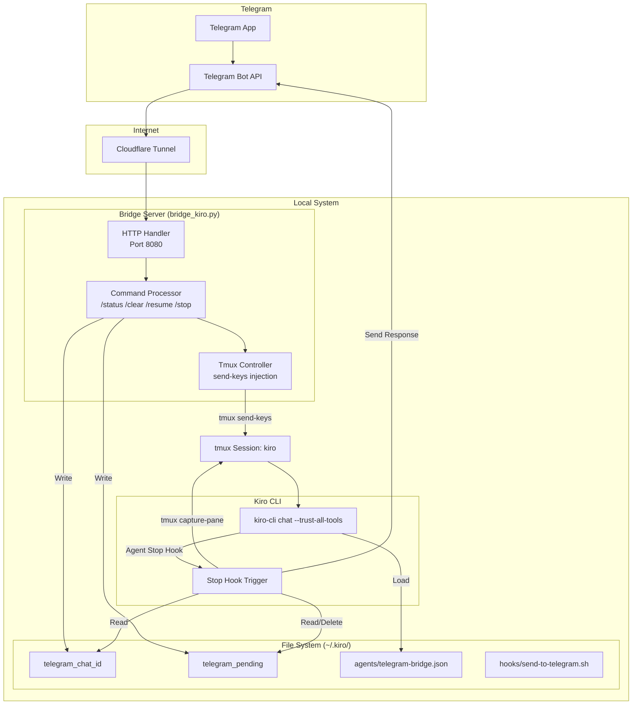

# kiro-telegram

[中文文档](README-cn.md) | [Migration Report](ClaudeCodetoKiroCLIMigrationAnalysisReport.md)

Telegram bot bridge for Kiro CLI. Send messages from Telegram, get responses back.

## How it Works



### Data Flow

1. **Message Receive**: Telegram → Cloudflare Tunnel → Bridge Server
2. **Message Injection**: Bridge Server → tmux send-keys → Kiro CLI
3. **Response Capture**: Kiro CLI Stop Hook → tmux capture-pane → Parse output
4. **Response Send**: Stop Hook → Telegram Bot API → Telegram

## Prerequisites

```bash
# macOS
brew install tmux cloudflared

# Verify kiro-cli is installed
kiro-cli --version
```

## Quick Start

### Option 1: One-Click Start (Recommended)

```bash
# Set Bot Token
export TELEGRAM_BOT_TOKEN="your_token_from_botfather"

# Run startup script
./start-kiro-bridge.sh
```

The startup script will automatically:
- Check environment variables and dependencies
- Create `~/.kiro/agents` and `~/.kiro/hooks` directories
- Install Agent config and Hook script
- Create tmux session and start Kiro CLI
- Start Bridge Server

### Option 2: Manual Setup

#### 1. Create Telegram Bot

Contact [@BotFather](https://t.me/BotFather) on Telegram, create a bot, get the token.

#### 2. Install Agent Config

```bash
# Create directories
mkdir -p ~/.kiro/agents ~/.kiro/hooks

# Copy config files
cp kiro-agent-config/telegram-bridge.json ~/.kiro/agents/
cp kiro-hooks/send-to-telegram.sh ~/.kiro/hooks/

# Set execute permission
chmod +x ~/.kiro/hooks/send-to-telegram.sh
```

#### 3. Configure Bot Token

Edit the Hook script to set your Bot Token:

```bash
nano ~/.kiro/hooks/send-to-telegram.sh
# Modify TELEGRAM_BOT_TOKEN="your_token_here"
```

Or set via environment variable (recommended):

```bash
export TELEGRAM_BOT_TOKEN="your_token"
```

#### 4. Start tmux + Kiro CLI

```bash
tmux new -s kiro
kiro-cli chat --trust-all-tools --agent telegram-bridge
```

#### 5. Run Bridge Server

In another terminal:

```bash
export TELEGRAM_BOT_TOKEN="your_token"
python3 bridge_kiro.py
```

#### 6. Expose to Internet

```bash
cloudflared tunnel --url http://localhost:8080
```

#### 7. Set Telegram Webhook

```bash
curl "https://api.telegram.org/bot${TELEGRAM_BOT_TOKEN}/setWebhook?url=https://YOUR-TUNNEL-URL.trycloudflare.com"
```

## Bot Commands

| Command | Description | Behavior |
|---------|-------------|----------|
| `/status` | Check status | Returns tmux session status |
| `/clear` | Clear conversation | Sends /clear command to Kiro CLI |
| `/stop` | Interrupt operation | Sends Escape key to interrupt |
| `/resume` | Resume session | Shows two options: Resume recent / Pick session |

## Environment Variables

| Variable | Default | Description |
|----------|---------|-------------|
| `TELEGRAM_BOT_TOKEN` | **required** | Bot token from BotFather |
| `TMUX_SESSION` | `kiro` | tmux session name |
| `PORT` | `8080` | Bridge Server listen port |
| `KIRO_AGENT` | `telegram-bridge` | Kiro Agent config name |

## File Structure

```
.
├── bridge_kiro.py                      # Bridge Server
├── start-kiro-bridge.sh                # One-click startup script
├── stop-clean-kiro-bridge.sh           # Stop and cleanup script
├── kiro-agent-config/
│   └── telegram-bridge.json            # Kiro Agent config
├── kiro-hooks/
│   └── send-to-telegram.sh             # Kiro Stop Hook script
└── README.md                           # This document
```

### Runtime Files

| File | Path | Description |
|------|------|-------------|
| Agent Config | `~/.kiro/agents/telegram-bridge.json` | Kiro Agent config, defines Stop Hook |
| Hook Script | `~/.kiro/hooks/send-to-telegram.sh` | Response sending script |
| Chat ID | `~/.kiro/telegram_chat_id` | Current Telegram chat ID |
| Pending Flag | `~/.kiro/telegram_pending` | Pending message timestamp |
| Hook Log | `/tmp/kiro-telegram-hook.log` | Hook execution log |

## Agent Configuration

`telegram-bridge.json` config structure:

```json
{
  "name": "telegram-bridge",
  "description": "Telegram Bridge Agent",
  "hooks": {
    "stop": [{
      "command": "~/.kiro/hooks/send-to-telegram.sh",
      "timeout_ms": 30000
    }]
  },
  "tools": ["*"],
  "allowedTools": ["*"]
}
```

- `hooks.stop`: Defines Stop Hook, triggered when Kiro completes a response
- `timeout_ms`: Hook execution timeout (30 seconds)
- `tools` / `allowedTools`: Grants all tool permissions

## Troubleshooting

### Check Hook Log

```bash
tail -f /tmp/kiro-telegram-hook.log
```

### Check tmux Session

```bash
# List sessions
tmux ls

# Attach to session
tmux attach -t kiro
```

### Check Pending File Status

```bash
# View pending file
cat ~/.kiro/telegram_pending

# Manual cleanup (if stuck)
rm ~/.kiro/telegram_pending
```

### Common Issues

| Issue | Cause | Solution |
|-------|-------|----------|
| No response after sending message | tmux session doesn't exist | Run `tmux new -s kiro` to start session |
| Hook not triggering | Agent not loaded | Confirm using `--agent telegram-bridge` at startup |
| Response timeout | Pending file expired | Check system time, clean pending file |
| HTML format error | Markdown conversion failed | Check Hook log, falls back to plain text |

## License

MIT
